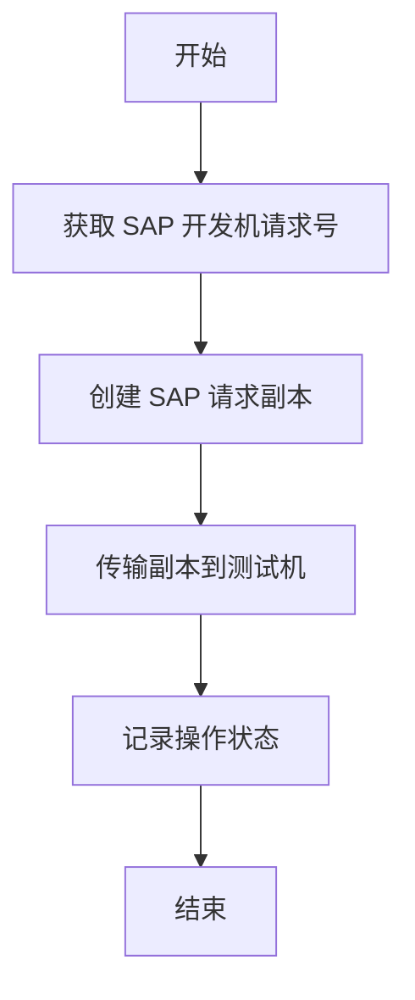

## 1. Product Overview
需求管理系统是一个基于 FastAPI + SQLite 的后端服务，用于管理 SAP 系统的开发和测试流程。
- 主要功能包括获取 SAP 开发机请求号、创建 SAP 请求副本、传输副本到测试机等。
- 目标用户是 SAP 系统管理员和开发人员，提高工作效率，减少手动操作。

## 2. Core Features

### 2.1 User Roles
| 角色 | 注册方式 | 核心权限 |
|------|---------------------|------------------|
| 管理员 | 系统配置 | 所有功能权限 |
| 普通用户 | 系统配置 | 基本操作权限 |

### 2.2 Feature Module
1. **API 接口**：SAP 接口调用、数据管理
2. **管理界面**：请求管理、状态监控
3. **配置管理**：系统配置、SAP 连接配置

### 2.3 Page Details
| 页面名称 | 模块名称 | 功能描述 |
|-----------|-------------|---------------------|
| API 接口 | SAP 接口调用 | 调用 SAP 接口获取请求号、创建副本、传输测试机 |
| 管理界面 | 请求管理 | 查看、编辑、删除请求记录 |
| 管理界面 | 状态监控 | 监控 SAP 操作执行状态 |
| 配置管理 | 系统配置 | 配置系统参数、日志设置 |
| 配置管理 | SAP 连接配置 | 配置 SAP 系统连接参数 |

## 3. Core Process
用户通过 API 调用获取 SAP 开发机请求号，创建请求副本，然后将副本传输到测试机。系统记录所有操作并提供状态监控。

## 4. User Interface Design
### 4.1 Design Style
- 主色调：#3B82F6（蓝色）、#10B981（绿色）
- 按钮样式：圆角按钮，悬停效果
- 字体：无衬线字体，大小适中
- 布局风格：卡片式布局，清晰简洁
- 图标风格：现代简约图标

### 4.2 Page Design Overview
| 页面名称 | 模块名称 | UI 元素 |
|-----------|-------------|-------------|
| 管理界面 | 请求管理 | 表格展示请求列表，操作按钮，搜索筛选 |
| 管理界面 | 状态监控 | 状态指示器，进度条，日志展示 |
| 配置管理 | 系统配置 | 表单输入，保存按钮，验证提示 |

### 4.3 Responsiveness
- 桌面优先设计，支持移动设备自适应
- 响应式布局，适配不同屏幕尺寸

### 4.4 3D Scene Guidance
- 不适用