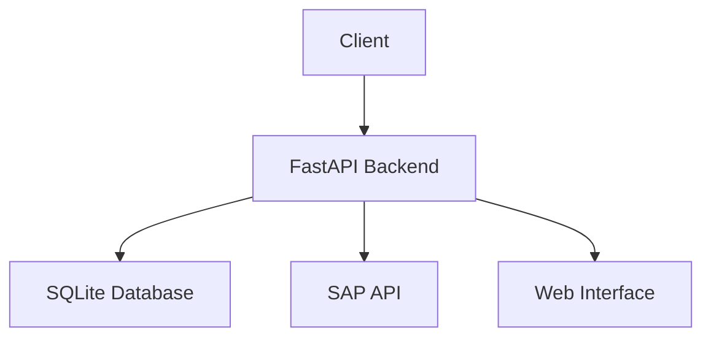
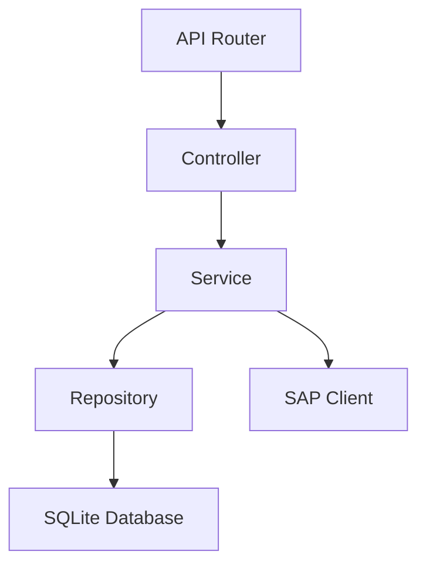
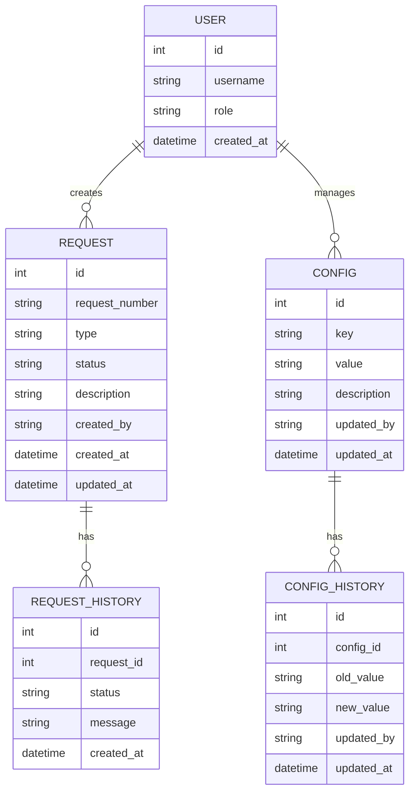

## 1. Architecture Design


## 2. Technology Description
- Frontend: React@18 + TailwindCSS@3 + Vite
- Backend: FastAPI@0.104.1
- Database: SQLite
- SAP Integration: Python SAP RFC Connector (pyrfc)
- Authentication: JWT

## 3. Route Definitions
| 路由 | 用途 |
|-------|---------|
| /api/sap/get-request | 获取 SAP 开发机请求号 |
| /api/sap/create-copy | 创建 SAP 请求副本 |
| /api/sap/transport-test | 传输副本到测试机 |
| /api/requests | 管理请求记录 |
| /api/config | 管理系统配置 |
| /admin | 管理界面 |

## 4. API Definitions

### 4.1 SAP 接口

#### 获取 SAP 开发机请求号
- **URL**: `/api/sap/get-request`
- **方法**: POST
- **请求体**:
  ```json
  {
    "system": "DEV",
    "user": "username",
    "description": "Request description"
  }
  ```
- **响应**:
  ```json
  {
    "request_number": "DEVK900001",
    "status": "success"
  }
  ```

#### 创建 SAP 请求副本
- **URL**: `/api/sap/create-copy`
- **方法**: POST
- **请求体**:
  ```json
  {
    "source_request": "DEVK900001",
    "target_system": "QAS",
    "user": "username"
  }
  ```
- **响应**:
  ```json
  {
    "copy_request": "QASK900002",
    "status": "success"
  }
  ```

#### 传输副本到测试机
- **URL**: `/api/sap/transport-test`
- **方法**: POST
- **请求体**:
  ```json
  {
    "request_number": "QASK900002",
    "target_system": "PRD",
    "user": "username"
  }
  ```
- **响应**:
  ```json
  {
    "transport_status": "completed",
    "message": "Transport successful"
  }
  ```

### 4.2 请求管理接口

#### 获取请求列表
- **URL**: `/api/requests`
- **方法**: GET
- **响应**:
  ```json
  [
    {
      "id": 1,
      "request_number": "DEVK900001",
      "type": "development",
      "status": "completed",
      "created_at": "2024-01-01T00:00:00"
    }
  ]
  ```

## 5. Server Architecture Diagram


## 6. Data Model

### 6.1 Data Model Definition


### 6.2 Data Definition Language

#### 创建请求表
```sql
CREATE TABLE IF NOT EXISTS request (
    id INTEGER PRIMARY KEY AUTOINCREMENT,
    request_number TEXT UNIQUE NOT NULL,
    type TEXT NOT NULL,
    status TEXT NOT NULL,
    description TEXT,
    created_by TEXT NOT NULL,
    created_at TIMESTAMP DEFAULT CURRENT_TIMESTAMP,
    updated_at TIMESTAMP DEFAULT CURRENT_TIMESTAMP
);
```

#### 创建请求历史表
```sql
CREATE TABLE IF NOT EXISTS request_history (
    id INTEGER PRIMARY KEY AUTOINCREMENT,
    request_id INTEGER NOT NULL,
    status TEXT NOT NULL,
    message TEXT,
    created_at TIMESTAMP DEFAULT CURRENT_TIMESTAMP,
    FOREIGN KEY (request_id) REFERENCES request(id)
);
```

#### 创建配置表
```sql
CREATE TABLE IF NOT EXISTS config (
    id INTEGER PRIMARY KEY AUTOINCREMENT,
    key TEXT UNIQUE NOT NULL,
    value TEXT NOT NULL,
    description TEXT,
    updated_by TEXT NOT NULL,
    updated_at TIMESTAMP DEFAULT CURRENT_TIMESTAMP
);
```

#### 创建配置历史表
```sql
CREATE TABLE IF NOT EXISTS config_history (
    id INTEGER PRIMARY KEY AUTOINCREMENT,
    config_id INTEGER NOT NULL,
    old_value TEXT NOT NULL,
    new_value TEXT NOT NULL,
    updated_by TEXT NOT NULL,
    updated_at TIMESTAMP DEFAULT CURRENT_TIMESTAMP,
    FOREIGN KEY (config_id) REFERENCES config(id)
);
```

#### 创建用户表
```sql
CREATE TABLE IF NOT EXISTS user (
    id INTEGER PRIMARY KEY AUTOINCREMENT,
    username TEXT UNIQUE NOT NULL,
    role TEXT NOT NULL,
    created_at TIMESTAMP DEFAULT CURRENT_TIMESTAMP
);
```